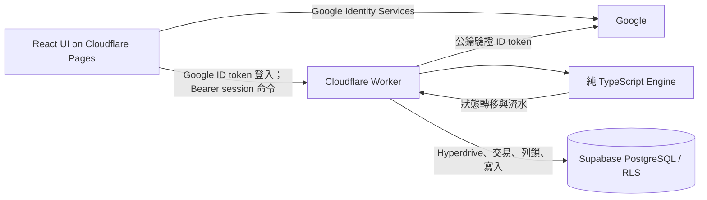

# 個人動態預算記帳 App — V1 技術設計

> 狀態：V1 實作中的技術契約。依據使用者提供的「V1 核心規格」；文末的開放問題只在實作對應功能前處理。

## 1. 目標與邊界

首頁回答「今天還能花多少」。收入週期、逐日預算、本期存款池與累積存款由同一套預算 Engine 計算；交易統計日期與預算生效日期分開。Supabase PostgreSQL 是唯一持久化資料來源。V1 不做銀行或信用卡同步、複式會計、投資與負債管理。

### 建議技術組合

| 層 | 選擇 | 職責 |
| --- | --- | --- |
| Web | React、TypeScript、Vite；Cloudflare Pages | 介面、表單、讀取狀態；不自行決定資金餘額 |
| Domain | 無 React／資料庫依賴的 TypeScript 純函式 | 日期、整數分配、資金轉移、分期拆分、狀態驗證 |
| API／命令入口 | Cloudflare Worker | 驗證 Google ID token、管理本站 session、驗證輸入與命令；呼叫 Engine 並原子寫入 |
| 身分與持久化 | Google Identity Services、Supabase PostgreSQL、RLS、版本化 SQL migration | Google 登入、本站使用者、週期快照、交易、資金流水 |
| 測試 | Vitest、Postgres 權限／整合測試、Playwright | Engine、並發／冪等、關鍵操作流程 |

Cloudflare Worker 是唯一資金命令入口，讓 TypeScript Engine 成為資金規則的唯一實作。Frontend 使用 Google Identity Services 官方按鈕的 JavaScript callback 取得 ID token，只送至 Worker 的登入端點。Worker 以 Google 公鑰驗證簽章、`aud`、`iss`、`exp`，再用不可變的 Google `sub` 查找或建立 `app_users`；不能用 email 連結帳號或相信 frontend 指定的 `user_id`。Worker 簽發三十天有效的本站 session JWT；Frontend 將 token 存於 `localStorage`，所有需要 session 的 API 都使用 `Authorization: Bearer`，Worker 驗證後才取得可信任的 `user_id`。CORS 僅允許設定的前端 origin 與必要的 `Authorization`／`Content-Type` header。儲存在瀏覽器的 token 須透過現有 CSP 與避免 XSS 的實作保護。Worker 以 Cloudflare Hyperdrive 連接 Supabase PostgreSQL，在**同一個資料庫交易**中鎖定該使用者預算狀態，計算並寫入完整命令。直接 PostgreSQL 連線由 Worker 以本站驗證的 `user_id` 明確限定每個查詢及寫入；Supabase 的 `anon`／`authenticated` 角色對私有表沒有直接權限，RLS 仍啟用且無瀏覽器政策。Frontend 不持有資料庫密碼、service-role key、JWT 簽章密鑰或 Hyperdrive 憑證。

正式站使用 `td.etontw.com`（Pages）與 `api.td.etontw.com`（Worker custom domain）；前端跨 origin 呼叫 API 時使用 Bearer header。Pages 的 `_headers` 對 Google 官方腳本、Google 登入 iframe 與 API 主機設定 CSP，並使用 `same-origin-allow-popups`。Google 要求從官方動態腳本網址載入 GIS，不能自行封存腳本版本；若變更正式 API 網域，須同步更新 Pages CSP、`VITE_API_URL`、Worker `FRONTEND_ORIGIN` 與 Google JavaScript 來源。本機 Worker 的 `DATABASE_URL` 比照運動紀錄使用 Supabase Session pooler（port 5432）；正式環境的資料庫連線仍由 Cloudflare Hyperdrive 管理。



## 2. 金額與日期契約

- 實際金額一律是整數 TWD。Domain 使用 `bigint`；Postgres 使用 `bigint`，並依欄位用途加正負值約束。API 以十進位字串傳輸金額，避免 JSON／JavaScript 浮點數失真。表單只接受非負整數；支出與收入交易金額須大於零。四個資金桶在 Engine 與資料庫都須維持非負。
- 單筆日常支出輸入最多 10 位數（上限 9,999,999,999 元），立即付款與分期總額均適用；Web 限制輸入長度，Worker 在呼叫 Engine 前再次驗證上限。
- 週期與交易歸屬使用 `DATE`／`YYYY-MM-DD`。建立時間、預算生效時間及事件時間使用 `TIMESTAMPTZ`。不可用固定 30 天或瀏覽器所在時區推導週期。
- V1 以 `Asia/Taipei` 為預設預算時區，並儲存在使用者設定。伺服器根據該時區求出今天；跨日補結算依伺服器日期，不信任裝置時鐘。變更時區的規則列為待決策事項。
- `cycleStart(year, month, day)` 使用 `min(day, 該月最後一天)`；`cycleEnd = nextCycleStart - 1 day`。例如設定 31 日，閏年 2 月起始日為 2/29。

## 3. Engine 狀態與守恆

每名使用者的目前狀態至少包含：

| 符號 | 意義 |
| --- | --- |
| `A` | 今日尚未使用的生活預算 |
| `F[d]` | 本期每個未來日期尚未分配使用的預算；總和記作 `F` |
| `P` | 本期存款池 |
| `S` | 累積存款 |

**已定案不變式：`A >= 0`、每個 `F[d] >= 0`、`P >= 0`、`S >= 0`。**一般支出、存款支付、已結算期補登、固定支出缺口、收入減額及對帳負向調整等所有扣款路徑均須遵守。支出即使超過該資金來源的可用額，交易仍記完整金額；資金桶只扣到 0，回傳 `insufficientFunds = true`，介面依整體或指定來源顯示不足提示。不建立負存款、欠款金額或負債模型。

### 開期優先順序與實際固定存款

設本期收入 `I`、固定支出目標 `E`、固定存款目標總額 `T`、開期前累積存款 `S₀`，皆為非負整數：

```text
固定支出由收入覆蓋 eI = min(E, I)
固定支出由存款覆蓋 eS = min(E - eI, S₀)
剩餘收入 R = I - eI
本期實際固定存款 Ta = min(T, R)
本期生活預算 L = R - Ta
開期後累積存款 S = S₀ - eS + Ta
insufficientFunds = (eI + eS < E)
```

順序固定為**固定支出 → 固定存款 → 生活預算**。固定支出缺口可使用既有 `S`，最多扣到 0；收入不足時，固定存款自動降至 `Ta`，不使用既有 `S` 來湊固定存款。此處「固定支出覆蓋額」是預算資金的預留／扣除，**不代表銀行已實際付款**。`recurring_items` 的設定目標 `T` 不變，只有該期快照的實際執行額降低。多筆具名固定存款若需降額，按各筆目標比例分配 `Ta`，整數餘額按餘數大小、再按固定排序及 ID 分配，保證各筆實際額不超過目標且合計恰為 `Ta`。

固定支出模板可設「月繳」或「年繳」，不受分類限制；保險、影音、AI 與雲端訂閱均可年繳。年繳保存全年名義金額及繳費月份 1–12，不除以 12，也不每月扣。因首次設定只詢問月份，排程以該月 **1 日**作為歸屬點：僅包含該日的收入週期將年繳全額列入固定支出目標，之後的每個週期略過，下一年同月再列入一次。跨月或跨年週期也依此唯一歸屬點處理。首期仍由使用者輸入已扣除待繳帳單的淨可用預算，模板不再重複扣款。

設定的「固定支出」列顯示目前模板的本月總額及啟用項目數。API 以伺服器預算日期的曆月起訖，沿用到期判斷，加總啟用的月繳與本月年繳項目，金額仍以整數字串回傳。此處是設定金額摘要；本期已預留與目標仍讀取週期快照，不因摘要計算而改動。預設下期生效的編輯會更新模板摘要，保留本期快照。

若 `L` 分配到 `N` 天，令 `q = L div N`、`r = L mod N`；依日期順序給前 `r` 天各 `q + 1` 元，其餘各 `q` 元。例如 `30,001 / 30` 得第一天 `1,001` 元、其餘各 `1,000` 元，總額仍是 `30,001`。

每次操作檢查實際可用資金 `U = A + ΣF[d] + P + S`：

- 生活預算與存款間的轉移、跨日／跨期結算，`U` 不變。
- 新增外部收入，`U` 增加實際入帳額。名義支出 `x` 全額記入交易統計，但只從該操作允許的資金桶實扣 `xa = min(x, 可用額)`；`U` 減少 `xa`，`xa < x` 時回傳 `insufficientFunds = true`。未覆蓋部分不進資金桶，不在未來收入到來時自動補扣。
- 開新週期時，`U` 增加 `I - (eI + eS)`；固定存款 `Ta` 是生活預算轉入 `S` 的內部轉移，不得額外增加 `U`。固定支出若只部分受資金覆蓋，仍保留完整固定支出目標與資金不足狀態。

這是**實際資金桶變動**的守恆檢查，不要求「完整交易金額 = 實扣資金」；兩者在資金不足時可以不同。它也不是銀行餘額公式，因為固定支出的實際扣款時間可能和週期預留時間不同。

## 4. 主要狀態轉移

| 操作 | Engine 規則 | 不可重複的紀錄 |
| --- | --- | --- |
| 開始週期 | 凍結該期收入、固定支出目標、固定存款目標及到期分期；先以收入及既有 `S` 覆蓋固定支出，再把實際固定存款 `Ta` 加入 `S`，剩餘收入形成 `A`／`F[d]`；未覆蓋固定支出只設資金不足狀態 | 每期唯一週期列、目標／實際快照、實扣流水 |
| 一般支出 | 依序扣 `A` → `P` → `F` → `S`，每桶最多扣至 0；扣 `F` 後只重排未來日期；仍有未覆蓋金額時保留完整支出並回傳資金不足 | 完整交易與每個資金桶的實扣事件 |
| 從存款支付 | 只扣 `S`，最多扣到 0；不動 `A`、`F`、`P`；交易仍以完整金額計入原分類統計，未覆蓋時回傳資金不足 | 完整交易與實扣存款流水 |
| 關閉非末日 | 將未花完的 `A` 分成 `ceil(A/2)` 進 `P`，`floor(A/2)` 加到隔日；今天尚未結束前不得執行 | 該日唯一結算列，保存剩額、入池額與隔日額，包含 0 |
| 關閉末日 | 將全部未花完的 `A` 移入 `P` | 該日唯一結算列，保存實際金額 |
| 關閉週期 | 將剩餘 `P` 全部轉入 `S`，`P` 歸零；固定存款不得再加一次 | 該期唯一結算列與存款流水 |
| 額外收入 | 預設加 `P`；若明確選擇生活預算，僅重排今日及未來日期 | 收入與預算事件 |
| 已結算期補登 | 帳務日期歸屬舊期；預算效果只從目前 `S` 實扣至 0，不重算已結算週期；未覆蓋時回傳資金不足 | 舊期完整交易、現在的實扣存款流水 |

一般支出超過 `A + P + F` 的同一筆交易，其剩餘部分立即從 `S` 實扣，最多扣至 0。若支出仍未全額受資金覆蓋，交易照常成功記錄，命令回傳 `insufficientFunds=true`，首頁顯示「可用資金不足」。只有在 `A + ΣF[d] + P = 0` 時才進入「本期收入已超支」；若此時 `S` 仍可覆蓋支出，尚未發生資金不足。若只是今日 `A = 0`，但 `F > 0`，不等於全期耗盡。

`insufficientFunds` 首先是**本次命令的結果**，並在原交易或週期結算紀錄保留歷史旗標。首頁的當前「可用資金不足」旗標只針對本期整體可用資金短缺：一般／固定支出未覆蓋時設為真；後續有新資金入帳且 `U > 0` 時清除，開新期時也依該期開期結果重設。指定「從存款支付」或已結算期補登若只有 `S` 不足、但 `A+ΣF+P > 0`，命令仍回傳 `insufficientFunds=true`，該筆交易顯示「累積存款不足」，不遮蔽首頁的今日可花額度；若 `U=0`，首頁可顯示整體不足。更正或刪除不足交易時，重新評估當前旗標。這些旗標都不代表欠款餘額，也不觸發未來收入自動補扣。

### 未來每日預算重排

一般超支扣到未來預算時，只重排**明日至期末**的 `F[d]`，不可因重排讓今天的 `A` 再次增加。固定支出增額沿用一般支出扣款順序，減額退款加入 `P`；固定存款變更遵守下文「v1.0.0 固定存款編輯」規則；實領減額仍以既有收入調整命令為準。所有重排均以固定日期順序分配整數餘數，並保持「重排前總額 ± 本次差額 = 重排後總額」；已關閉日不可修改。

### 跨日與跨週期補結算

每次讀取首頁或送出命令前，先執行 `advanceTo(today)`：從最後結算日逐日關閉到昨天；遇期末，先關閉末日、結算該期，再按新週期的快照開期。全部動作與本次命令放在同一個資料庫交易。每日、每期與固定存款事件設唯一鍵，因此多裝置同時開啟或網路重試不會重複入帳；不需要背景工作。若跨越多期，依日期先後逐期處理。

`closeDay` 直接回傳該日 `remaining/toPool/toTomorrow`，Worker 保存到 `day_settlements`，不以同一批命令的總流水猜測每天金額。舊版只存日期和命令 ID；migration 僅回填同一使用者／週期／命令恰好關閉一天且流水守恆的金額。多日批次保持 `null`，顯示「本日已結算，入池金額未留存」；0 元結算明確顯示 0。

### 設定的資金調整（2026-10-07 定案）

- 累積存款輸入「目前實際總額」，以 `AdjustSavings` 校正 `S`，`A/F/P` 不變；差額事件保存時間、原因與備註，既有每日及週期結算不改寫。首次設定可選填生活預算以外的累積存款，未填為 0；直接作為開期的既有 `S` 並記一筆 `opening_balance`，不再加入 `A/F`。
- 固定收入設定位於固定支出上方，可修改每月金額（允許 0）。預設下期生效，只改模板；立即套用比較當期收入快照，不以最近的模板為基準。增額沿用 Engine 的生活預算收入分配到今日與未來日期，減額依 `A→P→F→S` 實扣至 0；已結算日、已轉入的固定存款及固定支出預留快照保留，後續開期仍走原優先序。
- 收入項目保存不可變 `income_template_base` 與 `income_budget_base`；正常期兩者為開期月收入，首期分別是月收入與剩餘淨預算。立即套用的有效收入目標為 `max(income_budget_base + newMonthlyIncome - income_template_base, 0)`，只處理相對上次已套用目標的差額，避免首期再次加入整份月薪。舊資料 migration 只補基準，不調整餘額；流水以 `fixed_income_adjustment` 關聯模板及命令 ID。
- 固定支出可新增、編輯、停用及恢復，預設 `next_cycle`，只改未來模板；選 `current_cycle` 時比較當期凍結快照，不以最近的模板金額當基準。月繳與年繳沿用該月 1 日的週期歸屬。
- 本期增額依 `A→P→F→S` 實扣；減額只退 `max(previousFunded-newTarget,0)` 到 `P`。例如原目標 1,000、實扣 500，改成 800 不退款、改成 400 退 100。保存模板 ID、實扣／實退事件與當期目標／覆蓋額。
- 首期標記 `initial_net_budget`，原帳單保存 `included_amount`；本期有效目標為 `max(eligibleAmount-includedAmount,0)`。原帳單 1,000 改成 1,300，只扣 300；原帳單減至 800 不憑空退 200。先改下一期模板、再立即套用時仍使用原首期基準。
- 開期固定支出覆蓋總額按目標比例分配到項目快照，餘數按排序／ID 決定；每筆實際額不超過目標。此額代表預算預留，並非銀行已付款。

## 5. 交易、補登與修改

`transactions.transaction_date` 決定帳務統計與所屬收入週期；`created_at` 紀錄建立時間；`budget_applied_at` 紀錄首次預算生效時間。**每次修改產生自己的不可變資金事件**，並有獨立的 `applied_at`，不能只覆寫交易的單一 `budget_applied_at`。

- 補登本期已過日期：統計歸舊日期，資金變動在記帳當日套用，不 replay 舊日。
- 本期交易改金額：增加的名義差額依原資金來源再次嘗試實扣；減少或刪除時，**退款上限是該交易先前實際扣過的金額**，不可按未受資金覆蓋的名義差額憑空退款。設舊交易的累計淨實扣額為 `oldFunded`、更正後名義金額為 `newAmount`，減額時退款 `max(0, oldFunded - newAmount)`；未曾實扣的部分先被名義減額吸收。依 2026-10-08 使用者確認，生活預算交易的原帳務日期是今天時退款全回 `A`，本期其他日期退款回 `P`；已結算期或原來源是累積存款，退款只回現在的 `S`。例如原支出 1,000 元只實扣 500 元，改成 800 元退款 0 元，改成 400 元才退款 100 元。退款不改 `F` 或過去結算；每次變動留有原交易 ID、原因、實扣／實退資金桶及生效時間，交易的資金不足布林隨更正結果更新。
- 已結算期新增支出：統計歸舊期，目前 `S` 最多實扣至 0，未覆蓋時標記資金不足；舊週期快照及每日額度保持原樣。
- 改變 `funding_source` 或跨週期移動支出（2026-10-08 使用者確認）：先退回原交易累計實扣額，再依新來源對完整新名義金額套用一次 Engine。原交易屬於已結算期時退款只進目前 `S`；新日期屬於已結算期時新扣款只走目前 `S`。同一週期內只改日期不重扣；改分類／細項／商家／備註不產生資金事件。付款類型仍沿用原交易，分期只編輯所選單期，不轉換整份計畫。
- 額外收入更正（2026-10-08）：同位置的增減只處理名義差額；本期增額沿用原入帳位置，存款池減額先收回 `P`，不足再依 `A→F→S` 收回，生活預算減額依 `A→P→F→S` 收回。已結算期增減只調整目前 `S`。修改入帳位置或跨週期日期時，先收回完整舊收入（最多到目前可用資金為零），再加入新收入；未能收回的部分回傳資金不足，不建立負桶或未來自動追扣。
- `transactions` 使用 `deleted_at` 隱藏刪除項目，原資金流水與交易保留。`transaction_revisions` 保存修改前後快照及命令 ID；`revision` 防止不同裝置覆蓋已更新內容。每次更正和預算生效仍在同一 SQL transaction，成功命令重送不再調整資金。刪除項目排除於首頁、歷史、最近商家、月曆與摘要。
- 實領高於預計時，正差額依額外收入規則處理：預設進 `P`，可選加入生活預算。實領低於預計時，負差額只調整今天及之後的生活資金，不回算過去日；所有扣桶均以 0 為下限，具體分流順序仍須定案。固定項目選「套用本期」也只對今天及之後產生新事件；「從下期開始」只變更未來模板。期中固定項目增額不得直接重跑開期公式，若可用資金不足則標記資金不足；已結算期不可被模板更新改寫。

## 6. 分期規則

`total / count` 後續期數取整數商，餘額全放第一期。例如 `10,000 / 3 = 3,334 + 3,333 + 3,333`；此規則已由使用者於 2026-10-08 確認。V1 分期為 2–60 期，只使用生活預算，交易日期需在目前收入週期內。Domain `installmentSchedule` 按實際收入週期起日排程（首個部分週期亦佔一期），每期金額由 `splitInstallments` 計算。第一期立即套用一次生活預算支出；後續各期在對應收入週期開期時列入固定支出**目標**，並依開期資金優先序決定固定支出總覆蓋額。期次和固定模板共同以既有整數比例分配函式保存實際預留覆蓋額，這不代表銀行已付款。若該期資金不足，完整期次與統計仍保留，且各桶非負。後續期次交易的帳務日期為該收入週期起日，首次預算生效時間保存真正執行時間；已在開期預留的期次不得再次呼叫一般 `applyExpense`。購物統計按每期完整名義金額認列，計畫保存原始總額，不再另記總額支出。未來實際信用卡繳款也不另記支出。未來期次以 `(plan_id, installment_no)` 與交易唯一鍵防重複，全部與開期在同一個交易中完成。分期更正只修改所選已入帳期，原總額快照與其他期保留；單期金額不可超過原分期總額。刪除可勾選取消尚未入帳期數；已入帳的其他期與開期預留快照保留，未勾選時只刪除所選期。

快速記帳採「金額 → 分類 → 細項 → 項目／商家 → 其他設定 → 儲存」。日常分類預設餐飲、交通、購物、娛樂、生活、醫療、其他；固定支出分類以 `categories.scope` 獨立管理。`subcategories` 保存每個日常分類的用途細項及排序／隱藏狀態。交易與分期計畫保存分類、細項 ID 和名稱快照；`description` 為選填項目／商家，`note` 仍為真正備註。第五版 migration 隱藏舊日常分類並啟用七類，固定模板建立獨立分類關聯，所有歷史交易保留原名稱／ID，既有細項和商家預設 null；不從舊備註推測商家。最近商家從本人同分類交易去重取六個，同細項優先，沒有資料不顯示。金額、來源、日期及分期仍經 Worker 驗證，所有資金運算由 Domain 完成。

快速記帳的細項列將「其他」置於最後，其後「＋」可直接新增目前分類的細項；分類尚無細項時也保留入口。沿用 `SaveSubcategory` 的名稱長度、重複檢查及分類歸屬驗證，以獨立命令 ID 保存，不提交支出。成功後自動選取回傳的細項並保留整份支出草稿，即使首頁資料刷新失敗也可立即使用。Enter 只儲存細項、Escape 取消新增；切換分類關閉名稱欄位，支出另行確認儲存。

## 7. 建議資料表

下表是邏輯結構；欄位細節與索引在第一階段 migration 定稿。所有使用者資料表均有 `user_id`，外鍵與查詢也須限制該使用者。

| 資料表 | 主要內容／約束 |
| --- | --- |
| `app_users` | 本站 UUID、唯一 Google `sub`、顯示資料；所有資金資料的使用者外鍵指向此表 |
| `user_settings` | `user_id` 主鍵、週期起始日 1–31、時區 |
| `recurring_items` | 多筆預設收入／固定支出／固定存款；固定支出分類、月繳／年繳頻率及年繳月份；版本或生效週期與啟用狀態。舊資料預設月繳 |
| `cycles`、`cycle_items` | 週期起訖、該期曾發生資金不足的歷史旗標與狀態；固定支出目標總額與實際資金覆蓋總額、固定存款目標與實際轉存額分開保存；每筆具名固定存款的目標／實際額另存於快照，當期到期的年繳項目凍結分類、頻率、月份與全額，未到期年繳不進當期快照；`UNIQUE(user_id, start_date)` |
| `budget_state`、`day_allocations` | 當前 `A/P/S`、資金不足狀態、最後結算日、版本；每個未來日期的 `F[d]` |
| `transactions` | 完整名義金額、`insufficient_funds` 布林、分類、`transaction_date`、`created_at`、首次 `budget_applied_at`、帳務週期、付款類型、資金來源、備註；預留 `payment_account_id`／`payment_method_detail` |
| `budget_events` | 追加式實際資金桶增減及內部轉移；保存原因、`applied_at`、交易或週期來源、`command_id`，新增 `note` 與 `recurring_item_id` 追蹤存款校正和固定支出調整；未覆蓋差額不寫成事件或債務 |
| `day_settlements`、`cycle_settlements` | 每日與每期結算結果；每日新增 `remaining_amount/pool_amount/carried_amount`，完整金額或全部 null，且剩額等於入池額加隔日額；分別有 `(cycle_id, date)`／`cycle_id` 唯一鍵 |
| `installment_plans`、`installment_dues` | 總額、期數、每期金額、所屬週期、生效／取消狀態；`UNIQUE(plan_id, installment_no)` |
| `categories` | 名稱、線性 SVG icon key、排序、隱藏狀態；使用者內名稱 trim／忽略大小寫唯一，最多 200 個；歷史交易保留 category_id 與當時的 category 名稱，停用不刪除 |
| `reconciliation_accounts`、`reconciliation_entries` | 可選實際餘額快照及人工調整紀錄 |
| `command_receipts` | `(user_id, command_id)` 唯一；保存成功結果或可安全重試的識別 |

金額欄位採 `bigint`，原始交易金額須 `> 0`；資金事件差額可正可負，但提交後 `budget_state` 的 `A/P/S` 與每筆 `day_allocations.F[d]` 都有 `CHECK (amount >= 0)`，Engine 也先驗證同樣的不變式。固定存款快照有 `0 <= transferred_amount <= target_amount`；固定支出有 `0 <= covered_amount <= target_amount`。付款與資金來源使用受限制的值。資料結構、RLS 與授權均以 [Supabase migration](https://supabase.com/docs/guides/local-development/database-migrations) 管理。

## 8. 寫入、安全與讀取流程

1. Web 端由 Google callback 取得 ID token 後交給 Worker 換本站 session。之後只送出意圖命令與唯一 `command_id`，例如 `RecordExpense`、`CloseToToday`、`AdjustIncome`。金額輸入仍以字串傳輸。
2. Cloudflare Worker 驗證 Bearer session JWT，從已簽章的 session 取得 `user_id`；驗證命令參數及交易日期，不接受前端指定執行身分。登入端點先驗證 Google ID token，再建立使用者與 session。
3. Worker 經 Hyperdrive 使用單一 PostgreSQL transaction 鎖定該使用者的 `budget_state` 列，查詢 `(user_id, command_id)` 唯一的 `command_receipts`。已處理的同一命令直接回傳原結果；若同 ID 的請求內容不同則拒絕。狀態帶 `version`；並發命令依列鎖順序讀取最新版本並重新執行 Engine。若選用 optimistic concurrency，版本衝突時須重新讀取、重新計算後安全重試。
4. 載入必要週期、每日配額和模板；先 `advanceTo(today)`，再交由純 Engine 產生新狀態與事件。
5. 同一交易內寫入交易、週期／每日結算、預算與存款事件、狀態及命令收據。失敗則整筆回滾。Postgres 的[交易與列鎖](https://www.postgresql.org/docs/current/tutorial-transactions.html)可保證同一使用者的連續資金操作依序生效。
6. Web 端收到已提交的狀態再更新畫面。網路斷線時可保留草稿，但不得把未提交結果顯示為正式餘額；IndexedDB 最多是快取或暫存。

RLS 對所有私有表啟用，`anon` 與 Supabase `authenticated` 均無直接讀寫權限；本站 session 不是 Supabase Auth token，不應建立依賴 `auth.uid()` 的瀏覽器政策。Worker 端資料庫連線以已驗證的 `user_id` 明確過濾。核心資金命令不得拆成多個彼此獨立的 REST mutation。測試必須涵蓋匿名、本人、其他使用者三種身分，以及同一命令重送、多裝置同時寫入。

## 9. 介面與資訊優先順序

### 本期預算總額校正（v0.9.0）

設定的固定支出下方及首頁「本月可用預算」均開啟同一編輯視窗，輸入本期 `cycles.lifestyle_budget` 絕對總額。Worker 從本人目前週期取得舊總額；Domain 計算新舊差額，只改今天 `A` 與剩餘日期 `F[d]`。增額均分，餘數從今天起依序分配；減額先均分，容量不足的日期降至 0，再對其餘日期重新均分剩餘扣額。減額大於 `A + ΣF` 時整筆拒絕，不使用 `P` 或 `S`，不重播過去結算，不改收入／固定模板或下期預算。

`AdjustCycleBudget` 使用既有命令收據、使用者鎖及資料庫 transaction；`cycleId` 和 `expectedVersion` 必須吻合目前狀態，前端原始版本在視窗內凍結。成功重送先回放收據；409 衝突保留草稿、載入最新 dashboard，並要求關閉、重整後重新開啟。所有 `A/F` 差額以 `budget_adjustment` 事件保存及附調整原因；總額與每個每日額度仍限制在 PostgreSQL bigint 非負範圍。沿用既有資料表，無需 migration。

- 首頁先顯示「今天還能花多少」；`A+ΣF+P=0` 且累積存款仍可覆蓋支出時顯示「本期收入已超支」，本期整體可用資金不足時優先顯示「可用資金不足」。指定從存款支付但僅 `S` 不足時，在該筆操作顯示「累積存款不足」，保留仍有的今日可花額度。其次呈現週期起訖、今日交易、剩餘天數與快速記支出；`P/S` 顯示為次要資金摘要，完整內容在數據頁。
- 主導覽為「記帳｜紀錄｜數據｜設定」，搭配記帳本、月曆、長條圖及齒輪 SVG。記帳只列今日交易；紀錄上方為週一開頭的月曆，下方預設全部花費依日期／建立時間／ID 降冪，30 筆分頁。切換月份不篩掉歷史，點日期直接篩選下方並顯示實際結算額，返回其他導覽後保留月份和日期選擇。
- 記支出表單預設「從生活預算支付」與「立即付款」；主動選存款支付時顯示累積存款影響。補登可改帳務日期，並清楚顯示「預算會從今天調整」。
- 收入與固定項目頁逐筆管理，變更時提供「套用本期／從下期開始」。分期頁顯示每期金額和已發生／未來期數。
- 數據有「分類花費／存款」兩個分頁：本期摘要統計完整週期的已記錄支出（包含存款支付），點分類查看分頁明細；存款呈現 `S`、`P` 及最近 20 筆累積存款事件和調整原因。固定支出預留不另計為已記錄支出。
- 分類可新增、改名、排序、隱藏；已使用的分類保持歷史名稱與關聯。圖示採一致的線性 SVG，不使用 Emoji。
- 支出分類以點選按鈕呈現，可新增並自動選取；設定分財務、分類管理、外觀、帳號四組。外觀可跟隨系統或選深／淺色，主題色為綠／藍／紅，保存於裝置。編輯視窗使用原生 dialog，提供焦點限制、Escape 與背景關閉；未成功提交保留草稿，同內容重試沿用命令 ID。

讀取 API：`GET /v1/calendar?month=YYYY-MM` 查完整月的支出合計與結算；`GET /v1/summary` 查完整目前週期的分類合計；`GET /v1/transactions` 可依 `date`、`cycleId`、`category`（UUID／uncategorized）篩選及分頁。金額合計在 PostgreSQL 完成，不以已載入的 30 筆估算；游標保留 PostgreSQL 微秒精度，避免同時間交易漏頁。新增寫入命令為 `AdjustSavings`、`SaveFixedExpense`、`SaveCategory`、`ReorderCategories`，均沿用交易、列鎖與冪等收據。

## 10. 必要測試與驗收

Engine 單元測試需覆蓋原規格 16 條不變式及本次定案的四桶非負規則。下列五個案例是必過門檻；「不足」均指資金桶可實扣的部分已用完，完整名義支出／固定支出目標仍保留。

| 案例 | 輸入 | 必須得到的結果 |
| --- | --- | --- |
| 1. 存款剛好用完 | 一般支出扣完 `A/P/F` 後缺口 500；原 `S=500` | `S=0`，`insufficientFunds=false` |
| 2. 存款不足 | 一般支出扣完 `A/P/F` 後缺口 800；原 `S=500` | `S=0`，完整支出成功記錄，`insufficientFunds=true`，絕不出現 `S=-300` |
| 3. 固定存款降額 | `I=30,000`、`E=20,000`、`T=15,000` | 固定支出覆蓋 20,000，實際固定存款 10,000，`L=0`，`S` 增加 10,000；下期 recurring 目標仍為 15,000 |
| 4. 固定支出動用存款 | `I=15,000`、`E=20,000`、`T=5,000`、`S₀=10,000` | 實際固定存款 0，`L=0`，固定支出缺口 5,000 從 `S` 實扣，`S=5,000`，無資金不足 |
| 5. 固定支出仍未覆蓋 | `I=15,000`、`E=30,000`、`T=5,000`、`S₀=5,000` | 實際固定存款 0，`L=0`，`S=0`，完整固定支出目標保留，`insufficientFunds=true`；所有桶非負 |

年繳補充案例：12 月年繳保費 12,000 與每月手機費 500，在每月 10 日開期時，`11/10–12/09` 的固定支出目標為 12,500；`12/10–01/09` 不再包含保費。若另有 1 月年繳雲端服務 1,200，後者只在 `12/10–01/09` 計入，跨年不重複。

另驗證：`101 → P +51、隔日 +50`、期末剩額全進 `P`、`30,001 / 30` 分配總額、超支跨越 `A/P/F/S`、今日剛好花完、主動存款支付或歷史補登只從 `S` 實扣、負向收入／對帳調整也不使桶為負、補登與編修差額、分期餘數、31 日短月／閏年／跨年、漏開多日及重複執行無差異。加入「名義支出 1,000、實扣 500，改為 800 退 0、改為 400 才退 100」案例。性質測試對任意交易順序檢查 `A/F/P/S >= 0`、實扣額不超過可用額、資金桶變化與**實扣／實退**流水相等；不要求資金桶變化等於資金不足時的完整名義支出。

資料庫整合測試需驗證四桶非負 `CHECK`、固定存款目標／實際快照、完整交易與實扣流水的分離、單一操作原子性、重試冪等、並發順序、固定存款及分期不重複入帳、匿名與跨使用者隔離。端對端測試走過首次設定 → 記帳 → 跨日 → 超支 → 資金不足仍可記帳 → 補登 → 週期結算，檢查首頁、交易與實扣流水一致。

## 11. 實作前待決策

以下是**原規格未完全定義**的情況；建議在開始對應功能前，以範例輸入／輸出定案並寫入測試。

| 問題 | 建議暫定政策／需要確認的原因 |
| --- | --- |
| 週期中途首次設定 | 首個週期從設定當天起至下一個預設起始日前一天。引導流程收固定月收入、選填的生活預算以外累積存款、逐筆具名固定支出、首期到下次重置前的**淨可用預算**及重置日；該淨額作為首期可分配來源，首期固定支出與固定存款快照為 0，避免重複扣已納入淨額的本期帳單。固定收入及具名固定支出作為下期 recurring 目標，首次固定存款為 0，累積存款未填為 0；不補做未知過去日的 50/50。 |
| 全期耗盡後取得新收入 | 規格寫「直到下一期」維持超支狀態，但又允許額外收入加入生活預算；需定義是否能解除狀態。 |
| 當日選擇額外收入加入生活預算 | 建議從今日起（含今日）重排；須確定是否希望全額只加到未來日期。 |
| 本期固定支出變更（已定案） | 預設下期生效；立即套用增額依一般支出順序，減額只按實際覆蓋額退款到 `P`；首期原帳單基準另存，避免重扣和憑空退款。 |
| 本期固定存款變更（v1.0.0 待實作、規則已定案） | 三種生效方式；增加只從 A/F 轉 S、不足拒絕；減少只從 S 反沖可追蹤的本期實際轉存至 A/F、不足拒絕。不得改動歷史結算。 |
| 實領減少 | 仍依收入更正規則只影響當下與以後的資金，不回算已結算日。 |
| 週期起始日設定後變更 | 已建立週期的日期不可改寫；直接改月度起始日可能造成日期重疊或空窗。建議 V1 只在首次開期前可設定，日後若要變更須另外設計銜接週期。 |
| 修改資金來源或跨週期移動交易（2026-10-08 已確認並實作） | 支出退回原實扣額後，按新來源重新扣完整金額；已結算期只調整現在的 S，不重算過去日。 |
| 分期能否選存款支付（V1 已定案） | 只走生活預算，未來期為固定支出；累積存款與已結算期補登使用立即付款。 |
| 已預留固定支出的實際付款紀錄 | 固定支出在開期已扣除可分配預算；若另外記銀行實際扣款，不得再次套用生活預算支出。需定義其統計歸屬與識別方式。 |
| 對帳的「App 推估資金」 | 固定支出在預算上已預留，但實際銀行扣款日不定，`A+F+P+S` 不能直接當銀行總餘額；須先定義比較基準及差額扣哪個資金桶。 |
| 未來日期交易及時區變更 | 建議 V1 不允許未來交易，週期中不變更預算時區；避免尚未結算的日期產生歧義。 |

## 12. v1.0.0 固定存款編輯（規劃，尚未實作）

- 固定存款設定置於固定收入與固定支出之間；顯示 recurring 目標及本期快照實際轉存。選項：下期生效（預設）、僅本期立即生效、本期及未來立即生效。
- 下期生效只改 recurring 模板，絕不動 `A/F/P/S`；僅本期立即生效只改本期快照；本期及未來選項在同一 transaction 修改兩者，失敗全部回滾。
- 本期增加：計算新舊「實際轉存」差額 `delta > 0`，須 `A + ΣF[d] >= delta`，只從今天及未來生活預算均衡扣除並轉入 `S`。不可從 `P` 或既有 `S` 湊款，不足則整筆拒絕。
- 本期減少：可反沖額以本期**實際淨固定存款轉移**及目標差額為限，且 `S >= refund`；從 `S` 真正轉回今天及未來 `A/F[d]`，不是創建預算額度。用明確的轉存事件／快照追蹤可反沖額，反覆調高調低不能多退；不足整筆拒絕。整數分配沿用從今日起依日期排序的餘數規則。
- 首期已有使用者輸入的淨生活預算，首期即時調整只能移轉尚可用的生活預算；不得重跑月薪、固定支出或過往每日結算。週期目標及實際額快照保持 `0 <= actual <= target`；保留完整命令與資金事件、樂觀版本檢查。
- 驗收：目標 10,000／實際 6,000 降為 5,000 僅能轉回 1,000；今日／末日、S 不足、A/F 不足、0 元、同 ID 重送、跨期與雙裝置修改，失敗不能只改模板而不改資金。

## 13. v1.1.0 獨立預算計畫與外幣（規劃，尚未實作）

### 計畫資金與暫記超支

- 沿用 `A/F[d]/P/S`；每個計畫新增非負資金桶 `T[p]`。計畫可指定名稱、類型、選填起訖日期，隨時手動結束。新增獨立導覽「計畫」，進入計畫直接記帳；分類與商家共用一般記帳。
- 建立、追加資金僅從仍可用的 `A/F` 或 `S` 原子轉入 `T[p]`；資金不足拒絕，不動 `P`；轉移不算消費。總可用資金 `U=A+ΣF+P+S+ΣT[p]`，純提撥時 U 不變。
- 計畫支出即時從 `T[p]` 扣至零，完整名義支出照樣記錄；未覆蓋差額寫為**計畫待結算超支**（非資產、非實扣流水、非負存款或自動債務），**進行中不扣 `S`**。追加資金優先沖抵待結算超支的名義缺口，超過部分才增 `T[p]`，須明確記錄補足事件和對應交易，不可追溯篡改原交易或重計支出。
- 計畫進行中，取消／退款原先實扣的部分入 `T[p]`；計畫已結束則入 `S`。若退款關聯尚未實扣超支，先減少待結算缺口，不增加資金桶；退款／更正只反沖實扣額，商家實際現金退款須有獨立入帳事件，避免兩次增加資金。退款金額及已反沖次數應受交易修訂與唯一鍵限制。
- 結束計畫採預覽及確認：先計算待結算超支；從 `S` 實扣 `min(S, pending)`，若不足保留未覆蓋額及不足旗標，不建立負資金桶／自動負債。結餘 `T[p]` 全數轉入 `S`，標記計畫結束並記錄實際結算與事件。整筆在同一 SQL transaction，重試不可重複結算。結束後退款進 `S`，不得重開原計畫資金桶。計畫仍在進行時，不因跨月自動關閉或改寫已結算期。
- 例：計畫目標 20,000、支出 23,000，若未追加，進行中 `T=0`、待結算超支 3,000 且 `S` 不變；結束時才提示並從 `S` 最多扣 3,000。若先追加 3,000，先消除待結算超支，再結束就不需要從 `S` 補扣；支出統計仍只有 23,000。
- 資金守恆檢查區分「完整名義支出」「已實扣金額」「未覆蓋暫記」；暫記不是第二筆支出，提撥不是收入。計畫與一般記帳僅可有一筆交易及分類統計。

### 外幣記帳與匯率

- 所有預算 Engine 實扣／轉移仍使用整數 TWD；交易另外保存 `original_currency`、最小幣值整數 `original_amount_minor`、精確 decimal `exchange_rate`、`rate_date`、`rate_source`、`applied_twd_amount` 及選填 `project_id`。JPY 及 TWD 通常為零位小數，USD 為兩位；不能用 JS 浮點數直接做貨幣守恆。
- 一般／計畫記帳皆能選幣別，預設 TWD；自動帶入每日參考匯率，可手動輸入。Cloudflare Worker 排程每天取得有來源及**實際有效日期**的匯率，存入 PostgreSQL 並允許快取／備援；週末假日資料未更新應顯示實際資料日期，第三方不可用時可手動輸入。建議參考來源 [Frankfurter](https://frankfurter.dev/)，具體 API 版本及使用條款於開發時再確認。
- 儲存交易即凍結原幣與台幣金額；信用卡實際請款金額可透過原交易 revision 更正 TWD 並由 Engine 反沖／套用差額，不能修改既有歷史匯率或重複扣款。
- 顯示原幣及 TWD；彙總跨幣別以各交易保存的 TWD 金額計算，不以最新匯率回算。

### 建議新增邏輯資料結構及驗收

- `budget_projects`（基本資料、狀態及版本）、`project_fund_events`（提撥／追加／扣款／補足／退款／結束）、計畫待結算超支明細、`exchange_rates`（幣別對、有效日期、來源）、`transactions` 的外幣／計畫關聯。這些是未來 schema 草案，非現有資料表。
- 所有用戶資料加 user_id 與 RLS／唯一鍵；同一操作單 transaction、使用者與計畫列鎖、command receipt、狀態版本、事件稽核；驗證跨帳號、並發追加、超支後退款、部分退款、結束前後退款、S 不足、跨日／跨期和重複結算。

## 14. v1.2.0–v1.4.0 延伸規劃（尚未實作）

- v1.2.0：手動建立常用交易或從既有交易儲存範本；分類、細項、商家、備註、選填金額及編輯刪除。套用僅帶入草稿，按儲存才建交易與扣款。
- v1.3.0：每月支出趨勢、分類比較、每日／每月平均花費及海外／計畫篩選；交易完整名義統計一次，跨幣別取歷史保存的 TWD；提撥與未覆蓋暫記不能重複列為消費。
- v1.4.0：多帳戶實際餘額及人工對帳，須先明定未付款固定支出與預算資金的差異；完成前不得把預算桶總和宣稱為銀行帳戶餘額。

## 15. 參考資料

- [Vite 官方指引](https://vite.dev/guide/)
- [Vitest 官方測試指引](https://vitest.dev/guide/learn/writing-tests)
- [Playwright 官方文件](https://playwright.dev/docs/intro)
- [Cloudflare Workers 連接 Supabase PostgreSQL](https://developers.cloudflare.com/workers/databases/third-party-integrations/supabase/)
- [Google ID token 伺服器驗證](https://developers.google.com/identity/gsi/web/guides/verify-google-id-token)、[Supabase RLS](https://supabase.com/docs/guides/database/postgres/row-level-security)
- [Supabase migration](https://supabase.com/docs/guides/local-development/database-migrations)
- [PostgreSQL transactions](https://www.postgresql.org/docs/current/tutorial-transactions.html) 與 [row locks](https://www.postgresql.org/docs/current/explicit-locking.html)
